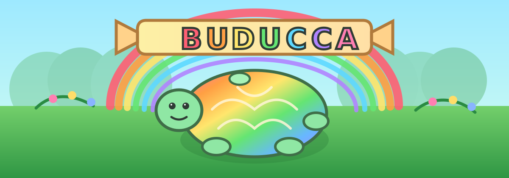

<p align="center">
  
</p>

# BUDUCCA

Control plane for messaging-first assistants.

BUDUCCA runs one assistant core across Telegram, Signal, WhatsApp, and Google Fi, with local workspace state, pluggable collectors, and OpenAI-compatible model endpoints. It is built for people who want modern open models in chat without a heavy SaaS stack.

[](https://t.me/buducca)

> [!IMPORTANT]
> BUDUCCA is pre-release software.
>
> BUDUCCA is not associated with any tokens, token sales, cryptocurrencies, investment vehicles, or other financial products.

## Why it is different

- Messaging-native: the primary UX is chat, not a web dashboard pretending to be an agent shell.
- Open-model ready: point `llm.json` at any OpenAI-compatible endpoint, including local servers.
- Grounded by files: skills and collectors write plain workspace files you can inspect, script, diff, and back up.
- Small enough to change: most of the repo is straightforward Python, not framework fog.

## Quick start

Copy the example config, wire one model endpoint, enable one frontend, then run the bot:

```bash
cp -R config.example config
$EDITOR config/llm.json
$EDITOR config/telegram.json
python3 run_bot.py --config config
```

For a fuller boot sequence, collector setup, and command reference, see [docs/getting-started.md](docs/getting-started.md).

## Open-model path

The model client speaks the OpenAI chat-completions shape. The simplest production path is:

- local `LM Studio` for the simplest OpenAI-compatible desktop setup
- local `Ollama` for fast single-node setup
- recent open instruct/reasoning models exposed behind either server

Relevant docs:

- `LM Studio`: <https://lmstudio.ai/>
- `Ollama` OpenAI compatibility: <https://docs.ollama.com/openai>

## Commands you will actually use

```bash
# Run the bot
python3 run_bot.py --config config

# Run collectors
python3 -m assistant_framework.cli collectors --workspace workspace --collectors collectors --config config/collectors

# Run a skill directly
python3 -m assistant_framework.cli skill summarize_workspace --workspace workspace --skills skills --args '{"max_items": 20}'

# Inspect the runtime skill surface the model sees
python3 -m assistant_framework.cli skills list --skills skills
python3 -m assistant_framework.cli skills inspect summarize_workspace --skills skills

# Inspect the latest trace
python3 -m assistant_framework.cli trace last-prompt --workspace workspace
python3 -m assistant_framework.cli trace replay --workspace workspace
```

In chat, the built-in operator commands are `/status` and `/skill`. Frontend details live in [docs/frontends.md](docs/frontends.md).

## Documentation map

- Start here: [docs/getting-started.md](docs/getting-started.md)
- Frontends and slash commands: [docs/frontends.md](docs/frontends.md)
- Architecture and extension points: [docs/developer-guide.md](docs/developer-guide.md)
- Plugin docs: `skills/<name>/README.md` and `collectors/<name>/README.md`
